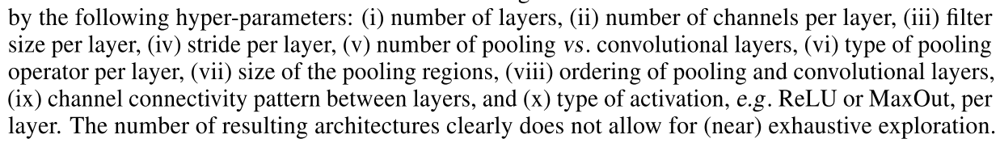
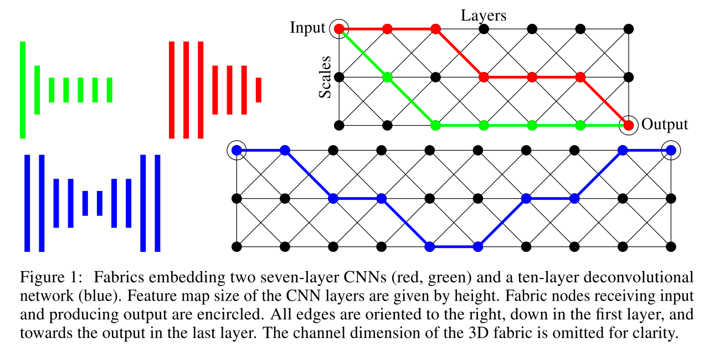
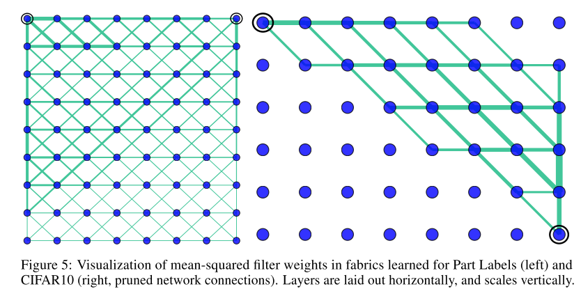
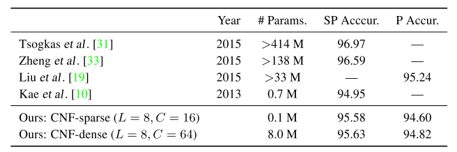
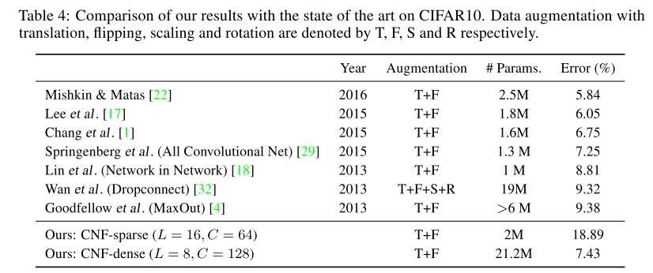

#! https://zhuanlan.zhihu.com/p/399506738
# 2016-NIPS-Convolutional Neural Fabrics
## 文章介绍

2016年NIPS，应对架构设计困难问题提出了一个新颖的3D模组，对之后的架构搜索设计有一定启发意义。

## 背景

深度学习已经在各个应用领域（CV,NLP）等取得了重要的成果，但是针对特定任务设计神经网络架构，寻求最优的网络架构需要耗费大量的时间，困难极大。

## 目的

为了解决以上问题，提出了一个新颖的Convolutional Neural Fabrics，在保持计算量线性增长的同时，Fabrics包含的子模型数量能够指数级增长（能涵盖图像分类和语义分割）。通过简单的梯度训练和剪枝，能够高效找到一个令人满意的架构。

## 研究方法

1. 设计了一个3D的模组空间，3个维度分别为layer，scale和channel，每个节点代表相应layer具有相应大小和通道数的卷积层，通道代表卷积层之间的连接。3D拓扑超网中的每一个子网对应现实中一个模型，所以Fabrics以**权重分享**的形式**集成了指数级的模型**，而参数量和计算量仅随layer和channel线性增长。

   

2. 训练的模型是密集型连接的，导致其参数量很大（且实验准确率并不理想），但是可以在不显著降低性能的情况下通过剪枝算法除去大部分较弱（权重很小）的连接，能够减少不必要的参数结构。

   

## 实验设计

1. Part Labels Dataset（语义分割）
2. MNIST（图像分类）
3. CIFAR10（图像分类）

## 结果

* 在语义分割上得到的数据集在保持参数量较小的情况下得到了很不错的结果
* 在图像分类数据集上结果非常不好（参数量很大，准确率也不算高）。**但是据我本人跑了一个简易版的2D模型（无tricks），得到的结果都要好于论文结果。2018年CVPR的Learning Time/Memory-Efficient Deep Architectures with Budgeted Super Networks这篇文章里，复现的结果也要远好于原论文。**

## 创新点

* 提出了一个很新颖的3D模型，在保持计算量线性增长的情况下，以权重分享方式集成了指数级的模型
* One-shot，supernet的思想已经出现
* 能够适应于一些Multi-Scale和Multi-Task的场景
* 训练结果代表了全局的架构，在一定程度上能够跳出人类先验知识

## 评论总结

* Convolutional Neural Fabrics可以说是穷尽了连续两层之间的并行与交叉结构，在集成训练这些模型上有着重要意义。但**缺陷在于并没有包括同时期Resnet的跳跃结构以及之后的DenseNet等结构**，在继承SuperNet思想的前提下，仍然要进一步优化模组的设计，尽可能多地包括已有的优秀架构。
* 与之后NAS普遍搜索Cell然后堆叠的思路相反，直接训练的的是全局的集成化结构（相当于直接训练了SuperNet），然后进行相应的剪枝。这两种思想（从小到大、从大到小）可以在今后的科研中进一步思考与挖掘。
* 所有节点均由3*3卷积层+ReLU构成，虽然文章证明了这样的结构包含了池化，不同大小的卷积核，不同的激活函数（MaxOut）作为特殊情况，但本质上还是一个trade-off的妥协，若将这些因素全都作为自由度考虑在模型中，那么这个Fabrics将会非常难设计，设计出来了也非常复杂，参数量很大，模型很难优化。

