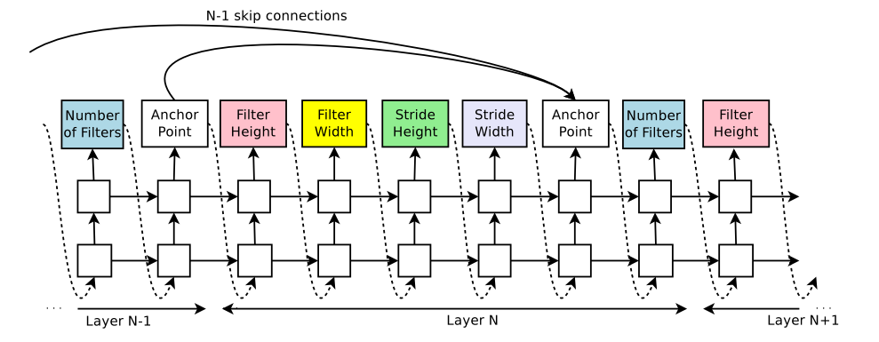
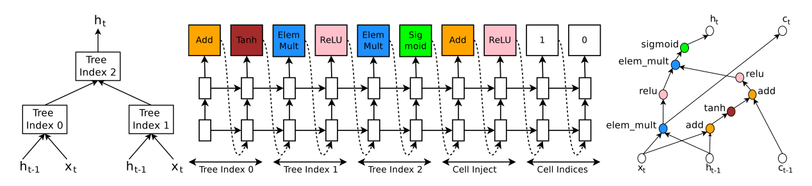
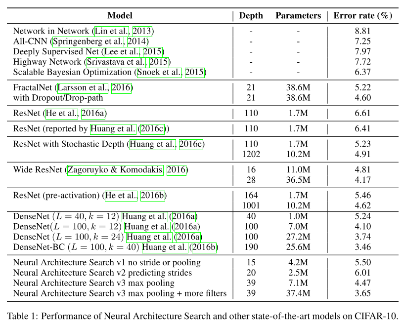

#! https://zhuanlan.zhihu.com/p/395394259
# NEURAL ARCHITECTURE SEARCH WITH REINFORCEMENT LEARNING
## 文章介绍

2017年ICLR，由Google Brain研究员Zoph提出，开创了神经网络架构搜索这个新坑，同时也是使用RNN+RL方法搜索网络架构的鼻祖。

## 背景

深度学习已经在各个应用领域（CV,NLP）等取得了重要的成果，但是

* 针对特定任务设计神经网络架构需要耗费大量的时间，依赖于专家的先验知识
* 更为厉害、新颖（非人类经验直觉）的网络结构很难被人类手动发现

## 目的

为了解决以上两个问题，提出了神经网络结构搜索，来自动化地搜索神经网络架构

## 研究方法

* 针对CNN，使用RNN+set-selection attention的方式生成连续字符串，映射到相应的网络架构（包含跳跃结构）

  

* 针对RNN，相应的借鉴传统RNN和LSTM，构建出相应的结构

  

* RNN生成序列后，得到网络架构。然后**从头训练至收敛**，并在验证集上得到准确率。
* 面对不可微优化，使用了RL中常见的Policy Gradient方法中的REINFORCE。RNN代表的是RL中的策略函数，奖励为验证集准确率。同时由于REINFORCE高方差的问题，使用了传统减去baseline的方法来减小方差。

## 创新点

* 开创了神经网络架构搜索新方向，实现了架构自动搜索
* 利用RNN+RL进行架构搜索的鼻祖
* 搜索的是全局结构，给予了网络较大的自由度，利于突破人类先验知识

## 实验设计

### CNN

* 数据集：cifar10
* 搜索空间：
  * 仅卷积层，步长限制为1。层数由人为控制。
  * 仅卷积层，并搜索步长。层数由人为控制。
  * 仅卷积层，并搜索步长，在特定位置加入池化。层数由人为控制。
  * 仅卷积层，并搜索步长，在特定位置加入池化，手动加入更多的通道数。层数由人为控制。

### RNN

待学习完NLP后（TODO)

### 迁移能力测试

进行了一个NLP方面的任务迁移测试（TODO）

## 结论

* 基于NAS得到的网络架构在性能上完全拥有超越人类的潜能
* 在性能差不多的情况下，NAS得到的网络架构有着参数量更少的趋势
* 从实验上来看，得到的架构是局部最优点。但并没有特别好的几何形状解释（如对称性）

## 评论总结

* 开创了神经网络架构搜索新方向，也是首次利用RNN+RL的鼻祖，并且搜索的是全局结构
* 计算量相当恐怖（800张GPU训练了一个月），这是RL、演化计算等方法的通病（适用性广，实用性弱）
* 按照这个方法，确实可以搜索全局空间，并能加入池化等其它非卷积层，但显然，搜索空间会非常庞大。在搜索效率低的情况下，很难进行有效搜索。同时，利用RL优化更庞大的RNN也会更加困难。
* 对于特定的搜索目标来说，搜索空间仍然非常小。
* **未来的趋势一：搜索效率（搜索空间信息量、优化算法、探索算法、性能评估）与搜索空间大小的trade-off**
* **未来的趋势二：神经网络架构准则（对称性等优秀几何性质的发掘与利用），本质上属于探索生成算法**

## 延伸阅读

* 深度强化学习，基于python的原理与实践
* Sebastian Thrun and Lorien Pratt. Learning to learn. Springer Science & Business Media, 2012.
* Marcin Andrychowicz, Misha Denil, Sergio Gomez, MatthewWHoffman, David Pfau, Tom Schaul, and Nando de Freitas. Learning to learn by gradient descent，2016
* Ke Li and Jitendra Malik. Learning to optimize. arXiv preprint arXiv:1606.01885, 2016.

