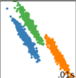
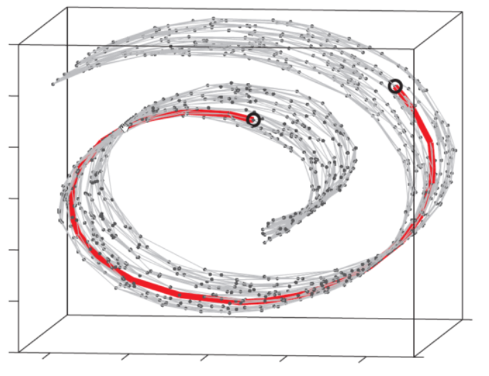
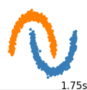
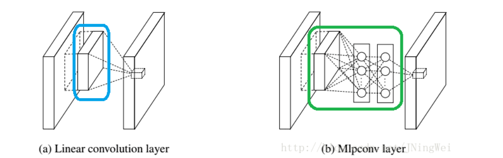
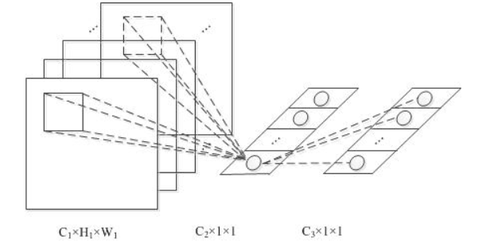

#! https://zhuanlan.zhihu.com/p/366745449
# NiN 论文阅读

$NiN$[<a href="#ref1">1</a>]是$AlexNet$问世不久后，在2014年由新加坡国立大学提出的，在$AlexNet$架构之上做出了进一步的改进，取得了SOTA的效果。我觉得这篇论文的动机讲得比较明确，思想也非常好，对神经网络架构设计有着较大的借鉴意义。

文章有两大创新点，一是将**线性的卷积核用非线性的多层感知机（微观网络）进行替代**，提高了对特征的抽象能力；二是**使用了平均池化层代替传统的全连接层**，极大减少了参数量，而且提高了可解释性。个人认为还有一个思想也是非常超前的，即**微观-宏观网络结构的思想**，这对神经网络价格搜索领域有着重大启示。本文着重对这几个方法进行讲解，**初学小白，存在谬误，敬请指出**。

## Mlpconv核

### 增强非线性特征提取能力

我相信有几句话，刚开始读的时候会觉得有些迷糊，甚至会觉得有些前后矛盾

> By abstraction we mean that the feature is invariant to the variants of the same concept
>
> The conventional convolutional layer uses linear filters followed by a nonlinear activation function to scan the input. 
>
> CNN implicitly makes the assumption that the latent concepts are linearly separable

我们先不考虑我们这篇论文的图像分类问题和卷积神经网络等等，我们就先看**分类问题的本质**。分类问题的本质正是在样本空间中（这里考虑高维欧氏空间，比如一个28*28的图像，可以看成是784维欧式空间上的一个点）对每一个类找到一个面，将它和其它类别的对象分隔开。如果存在这样的超平面的话，我们称这些样本是线性可分的。否则，称为线性不可分。

显然，对于绝大多数情况，样本数据都是线性不可分的，这就需要我们引入非线性表达。这也正是多层感知机中引入激活函数的重大意义之一[<a href="#ref2">2</a>]，没有非线性激活函数的引入，多层感知机无论叠多少层，仍然是一个普通的矩阵运算（线性变换），得到的是一个超平面。

现在回到论文中。为了增强网络整体的非线性表达，我们已经引入了大量的激活函数层（$ReLU$，$AlexNet$中特地说明过），我们的网络对各个类别的非线性分类已经取得了不错的效果。**而且传统的卷积层后紧接的就是$ReLU$层，弥补了非线性变化的缺乏，那为什么本文又特意强调卷积计算的线性性质的缺憾呢？**

我们同样利用**微观-宏观**的角度来考虑，从宏观上来看，不同类别之间的非线性分割我们已经做出了解答，而且效果似乎也不错，由于不同种类的物体往往还是有较大差别的（比如猫和狗），反映到样本空间中可能是这样的，不需要特别强的非线性表达。



**这篇文章的非线性优化点不是从我们想当然的宏观非线性增强，而是从微观角度进行考虑的**。回想一下，我们卷积核的作用是什么？**卷积核的作用正是将同一物体的不同特征给提取出来，而最后的分类正是基于这些微观特征的组合决定的**。特征提取的好坏显然会影响最后的结果，从这个角度考虑，我们的卷积核还好吗？

显然，我们希望我们的卷积核能够更好地抽象出特征，这是一个微观、且难度大于宏观分类的问题。举个通俗的例子，在处理猫狗分类的问题中，一个卷积核提取到了猫腿，一个卷积核提取到了狗腿。虽然猫腿和狗腿是比较相似的（至少比猫狗分类难吧），但作为一个好的卷积核，我们**希望它们能够更好地抽象出猫腿间的共同点、狗腿间的共同点以及猫腿和狗腿的不同之处**。猫腿和狗腿从本质上就是**嵌入在高维空间上的低维流形**[<a href="#ref3">3</a>，<a href="#ref4">4</a>]，我们下面从这两点来看看好的局部特征提取对非线性表达的要求。

> However, the data for the same concept often live on a nonlinear manifold, therefore the representations that capture these concepts are generally highly nonlinear function of the input.

首先，正如论文里的意思，特征提取的核应当能够**尽可能好地贴合局部特征的特点，而其它无关的信息应当尽可能少**（有点类似数理统计里的**充分统计量**哈哈哈）。现在，我们以猫腿为例，直观上来说，虽然同在一个高维的欧氏空间中，猫腿样本点的自由度会比猫的更低（维度更低的流形），但它的形状可能会更为复杂，比如，它**可能**像下图一样，线性卷积核是不可能对其进行贴合的，这就需要**很高的非线性表达能力**来贴合了。



第二个角度我认为才是关键的。显然，猫腿和狗腿是**比较相似**的，虽然它们的数据**虽然有本质的潜在的不同**，但在欧式空间来看，它们**会拥有杂糅在一起的趋势**（至少会比猫狗的数据更为杂糅）。它们的数据可能是如下图所示的，线性卷积核是不可能对其进行好的提取，要想很好地将其分别提取出来，必须要引进强的非线性表达能力。



综上，**线性卷积核难以满足高水平的局部特征抽象**。虽然我们紧随其后接上了$ReLu$层，但加上它的原因很大程度上是考虑最终结果（宏观）的非线性表达，并不是专门为底层的特征提取设计的。**虽然有一定的非线性程度引入，但我们有理由认为这对于高水平的局部特征提取是不够的。我们需要额外添加非线性能力。**

这便是论文的动机之一。在局部特征提取时加入更多的非线性函数进行更好的抽象。而多层感知机已经被证明是通用的拟合函数，所以本文使用了多层感知机组成的微型神经网络代替线性卷积核。

### MLP的连接形式



听说过$NiN$的人应该都知道，$NiN$的本质就是在传统的卷积层后添加了若干层核大小为1的卷积层，但论文中反复强调的是多层感知机的形式，然而却没有很精确地说明多层感知机组成的核具体是以什么计算方式代替传统卷积核的（**从图上来看并没有表示它是跨通道的多元感知机**）。最终，论文中一笔带过的一句解答了这个问题，这也是如今大家所说的$NiN\_Block$，即一个传统卷积层加若干个核大小为1的卷积层。

> The cross channel parametric pooling layer is also equivalent to a convolution layer with 1x1 convolution kernel

就我自己而言，初看这篇论文，多层感知机应该有两种连接方法。一种是单通道的形式，即类似于一个卷积核，只不过每个通道不再是一个矩阵，而是一个多层感知机，且类似于卷积核各个通道上的矩阵是相互独立的，各个通道上的多层感知机也是相互独立的。

另一种是先使用传统的卷积核，然后使用多层感知机跨通道进行计算，如下图所示，这种情况下是等价于1x1卷积核的。论文的架构是指这种。



**有空的话，我会补上这两种形式的数学推导。**

提一下1x1卷积核的优点吧，有点千篇一律：

* **加入非线性**，卷积层之后经过激励层，1*1的卷积在前一层的学习表示上添加了**非线性激励**，提升网络的表达能力。在本文中尤其着重于高水平抽象特征提取的提升
* **增加模型深度**，可以减少网络模型参数，增加网络层深度，一定程度上提升模型的表征能力
* **跨通道信息交互**，使用1x1卷积核，实现通道数改变操作其实就是channel间信息的线性组合变化


## 微观-宏观结构思想

我觉得这是当时研究者设计出这种架构的另一个原因。很直观的想法，**如果每一层都要人为地设计层的类型和参数，那真的是很不好的，这种做法主观偏见太强，偶然性也太强**。我们更**希望设计出一个小的模块，它被证明是好的，而且是可堆叠的**。这样，我们就直接进行套娃堆叠即可。同时期的$VGG$也采用了这种重复的堆叠思路，只不过它的想法是让网络达到更深更大的规模，实现更好的性能。

我甚至揣测，**这可能是这篇论文比较原始的动机**。这样想，一定深度的卷积（池化） + 全连接层已经被证明是相当有力（$AlexNet$），如果我们能把它给堆起来获得一个更大更深的网络呢？它的性能会不会更好？可惜的是，这样的处理是有缺陷的：

* 全连接层的输出要重新整合成图像的形式才能传入下一个块（虽然这是很容易做到的）,不自然
* 大的全连接层参数过多，重复进行占用内存过大，而且极易过拟合（主要原因）

综合两点，我们不由得尝试**去除全连接层**，这样子数据流将始终以特征图的形式存在，能够重复堆叠多个块。但全连接层去除之后，网络的非线性表达能力大大下降，而且存在极大欠拟合的风险。我们把这种大而深的**全连接层分散**到先前各个块的卷积核之后怎么样？好家伙，这不就是一个微型的卷积+全连接块嘛？实在是一举两得，**既做到了自然堆叠，也完成了微观堆叠块的设计**。私以为，论文中不断强调非线性能力的增强很大原因是为了弥补大全连接层去除后的巨大影响。而且，微型模块的一定动机可能就来源于此。

最后，从我将要follow的$NAS$[<a href="#ref5">5</a>]这个方向的角度来看，**微观-宏观架构**的观点异常重要。我们往往趋向于搜索出一个小的、可重复的、效果好的微观架构，然后再研究如何搜索出基于这种小架构组成的、好的宏观网络。$NiN$网络的设计思路无疑是极具启发性的。


## 全局平均池化

最后讲讲全局平均池化。在通过数个$nin\_block$之后，我们得到了一系列特征图，**如何转化成最后的类别输出呢**？**我们已经去除了最后大而深的连接层，如果再加上去也太没面子了**。不得不说，直接用全局平均池化的结果来作为类别输出确实很猛。优点在于：

* 无参数，避免了过拟合，极大极大减小了模型的内存压力
* 当最后一层特征图数量设计为类别数时，具有很好的可解释性
* 它是对全局取平均，对空间上的变化（平移等）更加鲁棒

**缺点是，它容易欠拟合。所以非线性表达能力一定要在之前就补上，我想这也是这篇文章必须强调增强非线性的一大原因。**

> We can see global average pooling as a structural regularizer that explicitly enforces feature maps to be confidence maps of concepts (categories). This is made possible by the mlpconv layers, as they makes better approximation to the confidence maps than GLMs.

## 模型代码复现

```python
import torch
from torch import nn


def nin_block(in_channels, out_channels, kernel_size= 1, stride= 1, padding= 0):
    block = nn.Sequential(
        nn.Conv2d(in_channels, out_channels, kernel_size, stride, padding),
        nn.ReLU(inplace= True),
        nn.Conv2d(out_channels, out_channels, 1, 1, 0),
        nn.ReLU(inplace= True),
        nn.Conv2d(out_channels, out_channels, 1, 1, 0),
        nn.ReLU(inplace= True)
    )
    return block

class NiN(nn.Module):
    def __init__(self, num_classes):
        super(NiN, self).__init__()
        self.num_classes = num_classes

        self.network = nn.Sequential(
            #(1*227*227)
            nin_block(1, 96, kernel_size= 11, stride= 4, padding= 0), #(96*55*55)
            nn.Dropout(),
            nn.MaxPool2d(kernel_size=3, stride= 2), #(96*27*27)

            nin_block(96,256,5,1,2), #(256*27*27)
            nn.Dropout(),
            nn.MaxPool2d(kernel_size= 3, stride= 2), #(256*13*13)

            nin_block(256,384,kernel_size= 3, stride= 1, padding= 1), #(384*13*13)
            nn.Dropout(),
            nn.MaxPool2d(kernel_size= 3, stride= 2), #(384,6,6)

            nin_block(384,self.num_classes,3,1,1),
            nn.AdaptiveAvgPool2d(1)
        )

    def forward(self, x):
        out = self.network(x)
        out = out.view(out.shape[0], -1)
        return out

def main():
    net = NiN(num_classes= 10)
    print(net)
    img = torch.rand((2,1,227,227))
    print(img)
    out = net(img)
    print(out)

if __name__ == '__main__':
    main()
```

## 参考文献

[<a href="#ref1">1</a>] <span name = "ref1">Lin, M., Chen, Q., & Yan, S. (2013). Network in network. arXiv preprint arXiv:1312.4400</span>

[<a href="#ref2">2</a>] <span name = "ref2">https://www.cnblogs.com/missidiot/p/9378079.html</span>

[<a href="#ref3">3</a>] <span name = "ref3">https://www.cnblogs.com/jiangxinyang/p/9314256.html</span>

[<a href="#ref4">4</a>] <span name = "ref4">https://blog.csdn.net/qq_16234613/article/details/79689681</span>

[<a href="#ref5">5</a>] <span name = "ref5"> JMLR, 2019. Neural Architecture Search: A Survey</span>


