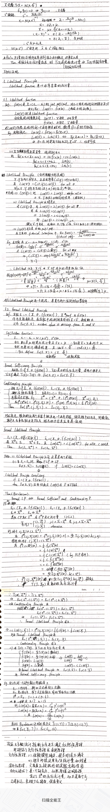

#! https://zhuanlan.zhihu.com/p/365021545
# 统计推断 似然原理

在介绍了充分性原理之后，我们接着介绍**似然原理**。

对于一个分布的概率密度函数，我们把参数看成不变量，而把值看成变量。现在我们从另一个角度出发，固定住一个观测的值，把参数看成变量，这就是**似然函数**，它反映了在观测值固定的情况下，参数取值的可能性（不等于概率）。

接着，我们介绍了$Likelihood\ Principle$，它的思想是在同一总体中取出的两个样本点，两个样本点的似然比若与参数无关，则它们拥有关于参数的信息是相同的，即它们将推断出同样的参数。

最后，我们逐步介绍了$Formal\ Sufficiency\ Principle、Conditionality\ Principle$和$Foraml\ Likelihood\ Principle$，并介绍了它们之间的关系。即前两个原理与最后一个是**等价**的（虽然证明似乎存疑）。

虽然现有的统计方法很多并不满足似然原理，很多统计学家也没有完全接受似然原理，但它优美简洁的特性仍然为我们提供了数据化简的思路。**即，可以依据似然值定义一个等价类，从而对样本空间做出划分，从每个子集中取出一个代表元形成一个简化的空间。**

