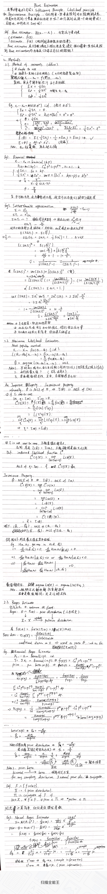

#! https://zhuanlan.zhihu.com/p/369658197
# 统计推断 点估计（一）

## Introduction

在第六章中，我们介绍了一些数据简化的思想，包括$Sufficiency\ Principle,\ Likelihood\ Principle,\ Equivariance\ Principle$。它们着重把握的是**一个量所包含的待估计参数的信息**。比如两个充分统计量相等，那么这两个充分统计量包含的参数信息是一致的，若借由这些信息进行推断，那么将得到一致的参数值；两个样本点的似然值成正比，那么这两个样本点包含的参数信息也是一致的，由此我们将推断出一样的参数估计值。

那么现在的问题是，我们**怎么样给定一个量，来作为参数的近似值，确切地估计参数呢？**对于一些简单的情况，我们可以利用直觉选择统计量（均值，方差等），但当分布变得复杂，参数意义不明显的时候，我们不能再依靠直觉，而是要找到切实可行的技术进行寻找。这篇文章将介绍**矩估计、极大似然估计和贝叶斯估计。**

## Moments Methods

矩估计大概是最古老的点估计方法了，它简单易行，就是**利用样本矩近似总体矩的思想**，常常能得到结果。但不幸的是，**矩估计所获得的估计量效果并不一定好**（估计量的值域并没有保证一定落在参数的取值范围内，比如一个参数必为正数，通过矩估计可能得出一个负值），所以在用矩估计获得统计量后，我们要对其进行一定的可行性评估。

矩估计的思想在于用样本矩来近似总体矩，**这是一种思想，而不是固定的方程组**。作为拓展，我们介绍了$Satterthwaite\ approximation$。在总体分布未知的情况下，我们可以自定义一个可能近似于总体分布的分布，然后利用矩估计的思想进行参数求解。从推导过程中，我们可以看出**矩估计方程的灵活性**，也同时说明**了矩估计求解优劣的不确定性。**

## Maximum Likelihood

极大似然估计可以说是目前最流行的估计方法了，这里不再去说极大似然估计常规的求解流程（取对数，求导之类的）。**极大似然估计的思想也非常简单，即在观测样本点的基础上，找到一组参数，使得这些样本点出现的概率最大。**下面说说极大似然估计的几个性质。

* 极大似然估计克服了矩估计的一大弱点，即**可以确保得到的推断的结果落在参数的取值范围内**（因为似然函数的定义域是自己拟定的）

* 一旦给出极大似然估计的表达式，就**演变成了一个最值问题**。我们要找到可能的最值，并证明它是最大值。在一元（单参数）问题中，最大值的来源为极值点和边界点。在多元问题中，逐渐复杂，即使通过求导我们能找到一个个极值点，但证明最大的点为最大值却并不容易。如果能够找到相应的不等式，我们不推荐使用单纯的导数判别法。
* 如果能给出估计量的解析解，通常会较为稳定。当表达式复杂或性质不好时，我们会利用数值计算得到数值解，这时就**一定要对解的稳定性进行考虑**。
* 在对似然函数进行一定修改后，我们能得到一个很好的性质，$Invariance\ Property$：$\hat{\theta}$是$\theta$的极大似然估计，那么对于任一函数$g$，$\hat{g(\theta)}$是$g(\theta)$的极大似然估计。

## Bayes Estimator

贝叶斯估计和之前所说的估计思想截然不同。**之前所说的方法都是将参数当作一个未知的常数，而贝叶斯方法将参数当作一个随机变量**，且赋予其人为的主观的先验分布，在观测到样本点后，**利用贝叶斯公式，得到该参数的后验分布**，从而更新对参数的认知。

* 贝叶斯估计实质上是**对历史经验（先验知识）和实验结果进行了一个整合**，给予了人为经验一定的权重。
* 贝叶斯估计在先验分布选择样本分布的**共轭分布**时，计算较为简单，待估计参数的先验与后验分布**仅仅是模型参数的不同**。教材中举出的例子为：**二项分布的共轭分布为$Beta$分布，高斯分布的共轭分布仍然为高斯分布**。

## Notes

