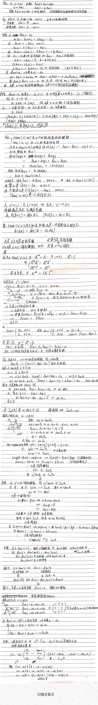

#! https://zhuanlan.zhihu.com/p/361411595
# 高等代数 线性映射（一）

## 线性映射定义、性质和存在性

在进行了矩阵计算和多项式两个铺垫之后，我们进入了高等代数中又一个激动人心的部分——线性映射。线性映射部分在丘老师的网课中有35节课，有大量的板书证明，我记的笔记也相当多，一次进行展示说明是不现实的。所以，我打算将线性映射分为几部分进行复习整合，然后发出。

**线性代数的核心就是研究线性空间和线性映射**。线性空间是具有加法和纯量乘法的代数系统，那么我们很自然要研究这么一个映射，它从一个线性空间$V$映射到另一个线性空间$W$，且保持加法和纯量乘法的特性。即：
$$
A： V \to W, \alpha \mapsto A(\alpha),\\
A(\alpha + \beta) = A(\alpha) + A(\beta)\\
A(k\alpha) = kA(\alpha)
$$
这就是线性映射，且称$V$到自身的线性映射为线性变换。

紧接着，我们研究了线性映射的一些基本性质（具体见笔记）。并证明了一个十分重要的**线性映射存在性定理**，即有线性空间$V，W$，其中$V$为有限维，记为$dimV = n$，从$V$中选出一组基$\alpha_1,...\alpha_n$，那么在$W$中任取$n$个向量$\beta_1,...,\beta_n$，都可以找到一个映射$A$，满足：
$$
A： V \to W \\
\alpha = \sum a_i\alpha_i \mapsto \sum a_i\beta_i
$$
可以证明，$A$是满足这种对应关系的**唯一的线性映射**。

## 线性映射的计算和结构

线性映射可以将一个线性空间中的一个向量转化成另一个线性空间中的一个向量，那么**线性映射本身可以定义运算吗**？如果有，它们具有什么性质呢？答案是肯定的。我们定义$Hom(V,W) = \{F:F为V\to W的一个映射\}$。直观且自然地在这个集合上我们可以定义加法、纯量乘、乘法以及幂运算。可以证明，对于定义的加法和纯量乘法，$Hom(V,W)$是一个**线性空间**；对于定义的加法和乘法，$Hom(V,W)$是一个**有单位元的环**。作为一个实例，我们研究了几何空间上的投影映射，它是线性变换，且是一个**幂等变换**。

## 线性映射的核与象

对于一个线性映射$A \in Hom(V,W)$，我们定义了它的核与象，即$KerA$和$ImA$，它们在研究线性空间的结构起着重要的作用。

* $KerA$是$V$的一个子空间，$ImA$是$W$的一个子空间。
* $A$是满射 $\iff$ $ImA = W$
* $A$是单射 $\iff$ $KerA = W$
* $V/ KerA$同构于$ImA$
* 当$V$为有限维时，$dimV = dim(KerA) + dim(ImA)$
* 当$dimV = dim W$时，$A$为单射 $\iff$ $A$为满射

打字好累，我以后还是佛一点...反正没人看，我以后还是直接贴图？自己看懂就行了？

