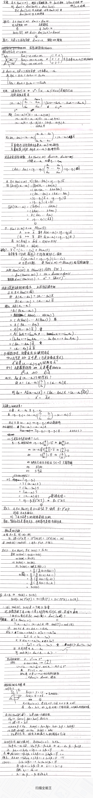

#! https://zhuanlan.zhihu.com/p/361689260
# 高等代数 线性映射（二）

由上一节的内容我们知道，对于一个从线性空间$V$到线性空间$W$的线性映射$A$，任取$V$中的一组基$\alpha_1,...\alpha_n$，若我们知道这组基对应的像$A(\alpha_1),...A(\alpha_n)$，则整个线性映射的像$ImA$**完全确定**。又$A(\alpha_i) = a_{1i}\beta_1 + .. + a_{si}\beta_s$，即可由$W$中的一组基表出。在两组基给定的情况下，我们将这些系数排列起来，可以得到一个矩阵，这个矩阵是**唯一**的，它称为线性映射在给定基下的矩阵。

我们定义映射$F:Hom(V,W) \to M_{sn}(F), A \mapsto \hat{A}$，可以证明$F$保持加法，纯量乘法和映射乘法。因此，$F$是一个**线性同构映射**。现在，我们终于知道了$Hom(V,W)$这个线性空间的维度，即 $dimHom(V,W) = dimM_{sn}(F)= s*n$，我们还能的到$rank(\hat{A}) = dim(ImA)$。

最后，我们探讨了两组基在同一线性映射下对应的矩阵和这两组基之间的过渡矩阵的关系，并由此引出了**矩阵相似**的概念。相似是一个等价关系，且在相似的条件下，**行列式、秩和迹是不变量**。

